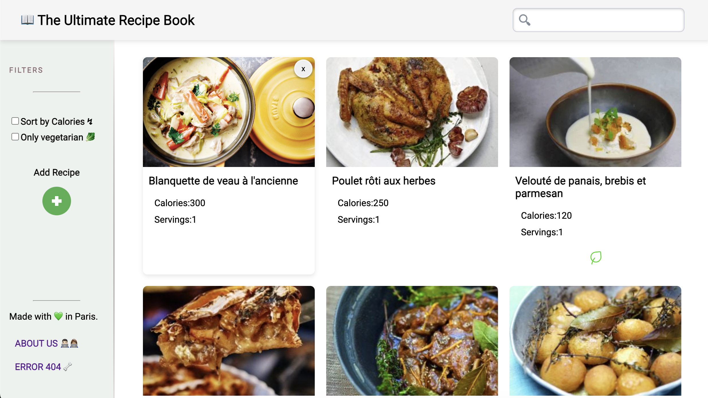

# Recipe Book 🍴 - by Mária FRIH & Julien THOMAS

### [Take a look](https://the-real-recipe-book-app.vercel.app/) 🤤

# ⚡️ Introduction

Welcome to Recipe Book, an application allows user to create, search, and delete their favorite recipes with ease.

# 🔥 Features

- 🔖 **Add recipe**
- 🗑️ **Delete recipe**
- 🔍 **Search recipe**

# ⚙️ Behind the scene

- ✨ **React motion component**
- 🔀 **Routing**
- 📂 **Manage JSON**

# 🤝 Collaboration

This project is a collaborative effort by Mária FRIH and Julien THOMAS using GitHub tools, combining their skills to create a Recipe Book App.

# 🌐 Credits

- JSON file Effects: [IronHack](https://gist.github.com/ironhack-edu/da324ca23b03e614a8dc8d016296c7f1)
